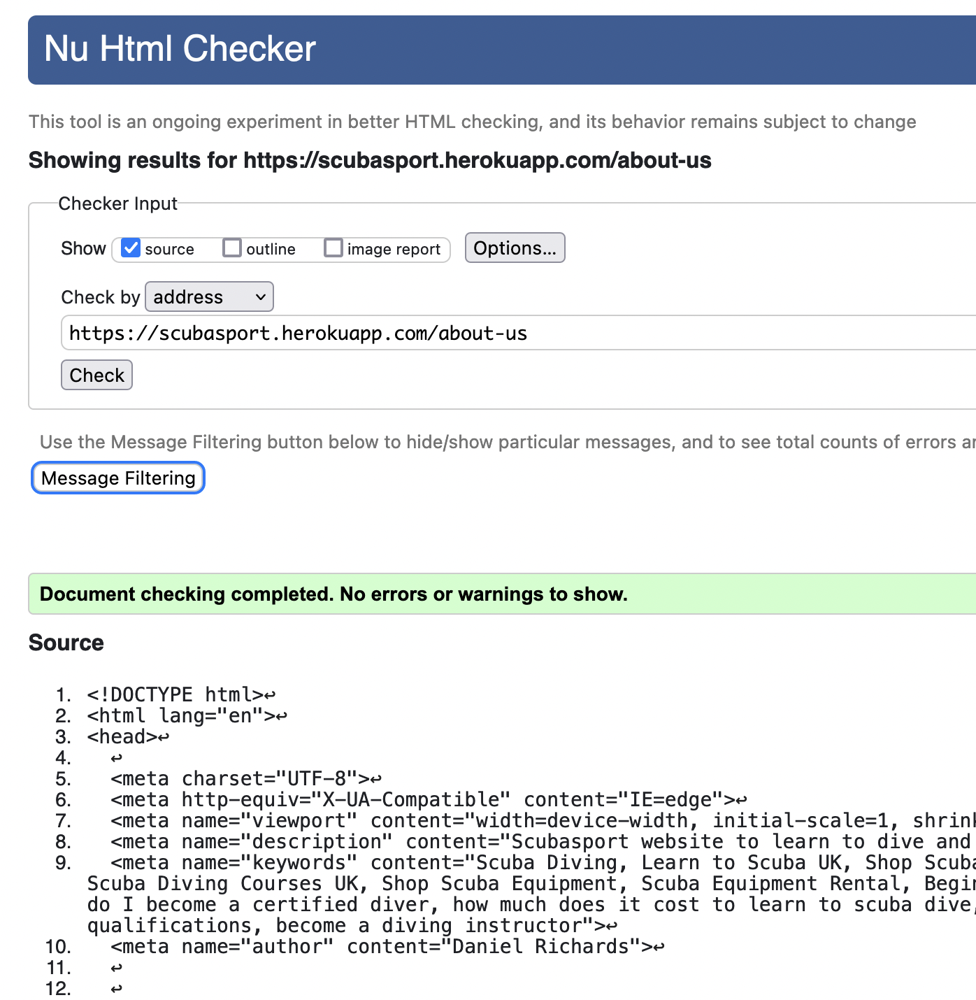

# Scubasport International
(Developer: Daniel Richards)

[View live site](https://elginis-restaurant.herokuapp.com/)

## Table of Content

1. [Project Goals](#project-goals)
    1. [User Goals](#user-goals)
    2. [Site Owner Goals](#site-owner-goals)
2. [User Experience](#user-experience)
    1. [Strategy](#strategy)
        + [Primary Goal](#primary-goal)
    2. [Structure](#structure)
        1. [Website pages](#website-pages)
        2. [Code Structure](#code-structure)
        3. [Database](#database)
        4. [Physical database model](#physical-database-model)
        5. [Models](#models)
            1. [User Model](#user-model)
            2. [Meal Model](#meal-model)
            3. [Category Model](#category-model)
            4. [Allergen Model](#allergen-model)
            5. [Drink Model](#drink-model)
            6. [DrinkCategory Model](#drinkcategory-model)
            7. [Comment Model](#comment-model)
            8. [Booking Model](#booking-model)
            9. [Contact Model](#contact-model)
            10. [Reason Model](#reason-model)
            11. [About Model](#about-model)
            12. [Chef Model](#chef-model)
            13. [Reasons Model](#reasons-model)
            14. [Home Model](#home-model)
    3. [Scope](#scope)
        1. [User Stories](#user-stories)
    4. [Skeleton](#skeleton)
        1. [Wireframes](#wireframes)
    5. [Surface](#surface)
        1. [Design Choices](#design-choices)
        2. [Colour](#colours)
        3. [Fonts](#fonts)
5. [Technologies Used](#technologies-used)
    1. [Languages](#languages)
    2. [Frameworks & Tools](#frameworks-&-tools)
6. [Features](#features)
7. [Testing](#validation)
    1. [HTML Validation](#HTML-validation)
    2. [CSS Validation](#CSS-validation)
    3. [JS Validation](#JS-validation)
    4. [Python Validation](#py-validation)
    5. [Accessibility](#accessibility)
    6. [Performance](#performance)
    7. [Device testing](#performing-tests-on-various-devices)
    8. [Browser compatibility](#browser-compatibility)
    9. [Testing user stories](#testing-user-stories)
8. [Bugs](#Bugs)
9. [Deployment](#deployment)
10. [Credits](#credits)
11. [Acknowledgements](#acknowledgements)

# User Experience
## Strategy
### Primary Goal
The primary goal of the website from the site 
owners perspective is as follows:
- To attract customers to the business by showing an attractive and appealing set of products and services.
- To allow a user to navigate the website and see course and product options easily
- To allow a user to make reservations, bookings, enquiries and purchases
- To allow users to engage with the business through local business and industry news

The primary goal of the website from a site users perspective is as follows:
- To view and purchase the dive shops products
- To view details about courses and book courses
- To search and filter the site for products
- To shop the site by category
- To contact the business or make enquiries
- To be made aware of social events

## Target Audience
- Families
- Couples
- Small groups of friends
- Diving enthusiasts
- Holiday makers (potential)
- Hobyists
- People looking for activities to increase social network (make friends)

## User Requirements and Expectations
- An easy navigation system with instant learning.
- Able to navigate the site quickly and easily.
- No broken links.
- Responsive and visually appealing on all devices.
- Ability to contact the business

## Structure
### Code Structure
The project is organised into a variety of applications, as is constructed using the Django Framework.

App details as follows:
- Home - this app contains information about the dive centre home page with quick links to the dive courses and product page, contact-us and about us via the nav bar.

It contains a footer with links to external sites and a mailchimp signup form.
- Products - this app contains the the product listings and detail views, users can add items to a shopping cart, filter for items in categories and hosts the results of the product search.  Clicking individual items opens a sub  page where users can see detailed product information.  The product app has a stock inventory so customers cannot add more to the bag than what is physically in stock.  When items are out of stock at that time this is rendered to the user.  Staff can create, read, update and delete product and inventory items.
- About - this app contains information relating to the business and frequently asked questions.
- Contact - this app is for users to be able to submit a message to the site owners and recieve acknowledgment.
- Profile - Users can choose to have a profile either when checking out or when authenticated.  Edit functionality exists and users can view thier purchase history.

To complement the apps there are
- project: Project level files - settings.py for project level settings and urls.py to route the website URLS
- templates: Containing the base.html, allauth(django authentication)
- templates (app level): each app has it's own templates directory for HTML to consider portability and re-use.
- urls (app level): each app has it's own url.py file to consider portability and re-use.
- static: Base css and Javascript files
- manage.py: This file is used to start the site and perform funcions during development
- README.md: Readme documentation
- Procfile: To run the application on Heroku
- Requirements.txt: Containing the project dependencies
Note: Environment variable values are not exposed in the source code, they are stored locally in env.py that is not checked in(and listed in .gitignore, and on Heroku in app settings

#### Physical database model

This model contains all fields stored in the database collections with their data type and mimics the structure of what is actually stored in the Postgres database 
 

#### Models
- The following models were created to represent the database model structure for the website

##### User Model
- The User model contains information about the user. It is part of the Django allauth library
- The model contains the following fields: username, password, first_name, last_name, email, is_staff, is_active, is_superuser, last_login, date_joined

##### Product Model
- The Product model contains information about products available within each of the categories
- It contains Category as a foreign-key.
- It contains holding(Inventory) as a Many-toMany relationship.
- The model contains the following fields:  name, friendly_name, description,  category, gender, brand, holding, color, price, promoted, image, slug.

##### Category Model
- The category model contains the available categories for a product item
- The model contains the following fields: name, friendly_name

##### Brand Model
- The Brand model contains brands for the products.
- The model contains the following fields: name

##### Size Model
- The Size model contains a the sizes available for each product. This is linked to the product model through a custom intermediate model as a many to many relationship.
- It acts as a foreign-key for Inventory model and through to Product
- The model contains the following fields: name, friendly_name

##### Color Model
- The Color model contains viable colors for the products.
- It acts as a foreign-key for Product model
- The model contains the following fields: name

##### Inventory Model
- The Inventory model is a custom intermediate model that between Size Model and Product model as a many to many relationship.  It has an inventory count as an additional field and self generates a unique SKU on save
- The model contains the following fields: product, size, sku, count

##### Course Model
- The Course model contains a courses that customers can enquire about.  There is a subclass for different difficulty levels.
- The model contains the following fields: name, friendly_name, description, extra_details, price, duration ,level, image, slug

##### Contact Model
- The Contact model contains a collection of data submitted by the user when messaging the site owner.
- It contains Reasons subclass as a with preconfigured choices for the user to select
- The model contains the following fields: reason, name, email, phone, postcode, street_address, message.

#### Faq Model
- The Faq model contains a collection of frequently asked questions and answers for users to be able to get commonly sought information from the site without having to get in touch.
- The model contains the following fields: name, friendly-name, question, answer.

------------------------TBC------------------------------------------------
<!-- ## Scope
### User stories:

#### First time user
1.	As a first time user, I want to be able to view the type of food the restaurant provides
2.	As a first time user, I want to see professional and appealing images of the food
3.	As a first time user, I want to be able to navigate the website quickly and easily
4.	As a first time user, I want to be able to view the full menu
5.	As a first time user, I want to be able to view food allergies and calories
6.	As a first time user, I want to be able to view a description and price of the food
7.	As a logged in user, I want to be able to leave a comment or review
8.	As a logged in user, I want to be able to see other user’s comments and reviews
9.	As a logged in user, I want to be able to edit and delete a comment I have made
10.	As a first time user, I want to be able contact the restaurant
11.	As a first time user, I want to be able to make a reservation
12.	As a first time user, I want to be able to view the restaurants location and opening hours
13.	As a first time user, I want to know about the business and it’s ethos
14.	As a first time user, I want to be able to see special offers and promotions.
15. As a logged in user, I want to be able to to sign in to, or create an account
16. As a logged in user, I want to be able to log out of an account
17. As a first time user, I want to be able to see separate menus for lunch, dinner and drinks
18. As a first time user, I want to be able to view the business’ social media

#### Site Owner
19.	As a site owner, I want to attract customers to our restaurant
20.	As a site owner, I show appealing and professional images of our food
21.	As a site owner, I want users to be to view our full menu
22.	As a site owner, I want users to be able to view the food descriptions and prices
23.	As a site owner, I want users to be able to view allergies and calories
24.	As a site owner, I want users to be able to make a reservation with data validation so they can only book future dates and in valid opening time.
25.	As a site owner, I want users to be able to leave a comment or review
26.	As a site owner, I want users to be able to view other comments and reviews
27.	As a site owner, I want users to be able to edit and delete comments or reviews
28.	As a site owner, I want users to be able to contact the business
29.	As a site owner, I want users to be able to view the location and opening times
30.	As a site owner, I want users to be able to find out about our business ethos
31.	As a site owner, I want users to be able to have an idea of the restaurant’s welcoming atmosphere so they will make a reservation
32.	As a site owner, I want users to be able to navigate the site easily and quickly
33. As a site owner, I want to be able to promote special offers and events.
34. As a site owner, I want users to be able to sign in to, or create an account
35. As a site owner, I want users to be able to log out of their account
36. As a site owner, I want users to be able to see separate menus for lunch, dinner and drinks
37. As a logged in administrator, I want to be able to review and approve or delete user comments.
38. As a site owner, I want users to be able to view the business’ social media
39. As a logged in administrator, I want to be able to create, edit or remove content on the website.

#### Error Flow
40. As first time, I user should be able to navigate back through the site structure in case of page not found without using the browser back button.
41. As a site owner, I want a 404 page that enables users to be able to return to valid areas of the site without using browser controls.

## Skeleton

### Wireframes

Home

About

Contact

Menus

Dinner Menu

Drinks

Lunch Menu

Meal Details

Sign In

Sign Up

Logout

Reservation

Errors

## Surface
### Design choices

The overall design of the website was to keep it clean and simple, to allow the imagery of the food to shine through, and to choose colours that didn’t distract or take focus. The website also needs to act as a portfolio to attract users to book and visit the restaurant, so we chose a gallery image layout for the menu, and made sure to include photography of the staff and restaurant interior.

The site is straightforward to navigate, with a high contrasting navigation bar to enable ease of use for the user to find other main pages.

The background is neutral but bright, the images are the focal point of the home page so the user has an immediate view of the food. The rest of the colour scheme is reflecting the rustic Italian interior of the restaurant.

### Colours

The colour palette is fairly neutral and warm. The bold colours that are used in focal points such as buttons and titles, and the neutrals are used for backgrounds and body text.

- #212529 - Title text
- #4F4F4F - Body text
- #5A753A - Buttons
- #703D30 - Lines and subtitles
- #FBF4E1 - Background
- #FFFFFF  - Logo and header links

After choosing a colour scheme I tested a number of palette options to make sure the it met accessibility standards.

 

### Typography
Maria Rose is the font uses for the logo, and is replicated in the main headings of the website. This font is licensed from Creative Market, with a standard license for personal use.

Josefin Sans is the font used across all of the body text, this font is from the Google Fonts Library.

## Features

The site contains 12 pages and
1. Home page
2. Full menu
3. Food description
4. lunch menu
5. dinner menu
6. drinks menu
7. about
8. contact
9. reserve
10. login
11. sign up
12. log out

### Page 1 - Home page
The home page consists of the following features:

#### Feature 1 - Header and navigation Bar, the header and navigation bar are shown across all pages.
The header shows the logo of the website, as well as a navigation bar with quick access to the main pages of the website. 
 

This feature covers the following user stories

*3.	As a first time user, I want to be able to navigate the website quickly and easily*

*10. As a first time user, I want to be able contact the restaurant*

*11. As a first time user, I want to be able to make a reservation*

*15. As a logged in user, I want to be able to sign in to, or create an account*

*16. As a logged in user, I want to be able to log out of an account*

*21. As a site owner, I want users to be to view our full menu*

*24. As a site owner, I want users to be able to make a reservation with data validation so they can only book future dates and in valid opening times.*

*28. As a site owner, I want users to be able to contact the business*

*32. As a site owner, I want users to be able to navigate the site easily and quickly*

*34. As a site owner, I want users to be able to sign in to, or create an account*

*35. As a site owner, I want users to be able to log out of their account*

#### Feature 2 - Carousel

The carousel consists of 3 hero images, which play automatically upon landing on the page. It can be used by the site owner to promote any special offers and events.
 

This feature covers the following user stories

*1.	As a first time user, I want to be able to view the type of food the restaurant provides*

*2.	As a first time user, I want to see professional and appealing images of the food*

*14. As a first time user, I want to be able to see special offers and promotions.*

*19. As a site owner, I want to attract customers to our restaurant*

*20. As a site owner, I show appealing and professional images of our food*

*33.  As a site owner, I want to be able to promote special offers and events.*

*39. As a logged in administrator, I want to be able to create, edit or remove content on the website.*

#### Feature 3 - lunch, dinner and drinks images with buttons

The menu images show an image of the restaurant food with a clear button overlay which takes the user directly to the relevant menu page quickly and easily.
 

This feature covers the following user stories

*1.	As a first time user, I want to be able to view the type of food the restaurant provides*

*2.	As a first time user, I want to see professional and appealing images of the food*

*3.	As a first time user, I want to be able to navigate the website quickly and easily*

*4.	As a first time user, I want to be able to view the full menu*

*17. As a first time user, I want to be able to see separate menus for lunch, dinner and drinks*

*19. As a site owner, I want to attract customers to our restaurant*

*20. As a site owner, I show appealing and professional images of our food*

*21. As a site owner, I want users to be to view our full menu*

*36. As a site owner, I want users to be able to see separate menus for lunch, dinner and drinks*

#### Feature 4 - footer 
The footer features the business’ social media links, as well as links to the main pages the user would want to navigate.
 

This feature covers the following user stories

*3.	As a first time user, I want to be able to navigate the website quickly and easily*

*18. As a first time user, I want to be able to view the business’ social media*

*32.As a site owner, I want users to be able to navigate the site easily and quickly*

*38. As a site owner, I want users to be able to view the business’ social media*

### Page 2 - Full Menu
The full menu page has an internal navigation bar to guide the user through the menu sections. It also shows the restaurant’s full list of food dishes with images, descriptions, prices and dietary requirements. The images are professional quality and are shown in a clear grid layout, separated with header images.

It consists of the following features:

#### Feature 1 - internal navigation bar
The internal navigation bar helps the user to browse the menu without scrolling through the whole page.
 

This feature covers the following user stories

*1.	As a first time user, I want to be able to view the type of food the restaurant provides*

*3.	As a first time user, I want to be able to navigate the website quickly and easily*

*6.	As a first time user, I want to be able to view a description and price of the food*

*20. As a site owner, I show appealing and professional images of our food*

*22. As a site owner, I want users to be able to view the food descriptions and prices*

*32. As a site owner, I want users to be able to navigate the site easily and quickly*

#### Feature 2 - Full menu image gallery
The full menu image gallery shows a professional image of each individual dish, with the dish name and brief description, as well as the price and dietary requirements.
When the user selects on the image a new page opens for the item, which includes additional information including the allergy and nutritional values.
 

This feature covers the following user stories
*1.	As a first time user, I want to be able to view the type of food the restaurant provides*

*2.	As a first time user, I want to see professional and appealing images of the food*

*4.	As a first time user, I want to be able to view the full menu*

*6.	As a first time user, I want to be able to view a description and price of the food*

*19. As a site owner, I want to attract customers to our restaurant*

*20. As a site owner, I show appealing and professional images of our food*

*21. As a site owner, I want users to be to view our full menu*

*22. As a site owner, I want users to be able to view the food descriptions and prices*

### Page 3 - Food description
The food description page is shown when a user clicks on the image of an individual item. The page enables users to find out a more detailed description of the item including the allergies and calorie content.
It consists of the following features:
 

Feature 1 - the additional nutritional information
The additional nutritional information includes: 
- Known allergies of the item, shown in text and a clear illustrated symbol.
- Calorie content

This feature covers the following user stories

*2.	As a first time user, I want to see professional and appealing images of the food*

*5.	As a first time user, I want to be able to view food allergies and calories*

*6.	As a first time user, I want to be able to view a description and price of the food*

*19. As a site owner, I want to attract customers to our restaurant*

*20. As a site owner, I show appealing and professional images of our food*

*22. As a site owner, I want users to be able to view the food descriptions and prices*

*23. As a site owner, I want users to be able to view allergies and calories*

### Page 4 - Lunch Menu
The lunch menu page shows items on the lunch menu only. It has an internal navigation bar to guide the user through the menu sections. It also shows the item’s image, descriptions, price and dietary requirements. The images are professional quality and are shown in a clear grid layout, separated with header images.
It consists of the following features:
#### Feature 1 - internal navigation bar
The internal navigation bar helps the user to browse the menu without scrolling through the whole page.
 

This feature covers the following user stories

*1.	As a first time user, I want to be able to view the type of food the restaurant provides*

*3.	As a first time user, I want to be able to navigate the website quickly and easily*

*6.	As a first time user, I want to be able to view a description and price of the food*

*22. As a site owner, I want users to be able to view the food descriptions and prices*

*32. As a site owner, I want users to be able to navigate the site easily and quickly*

#### Feature 2 - Lunch menu image gallery
The full menu image gallery shows a professional image of each individual dish, with the dish name and brief description, as well as the price and dietary requirements.
When the user selects on the image a new page opens for the item, which includes additional information including the allergy and nutritional values.
 

This feature covers the following user stories

*1.	As a first time user, I want to be able to view the type of food the restaurant provides*

*2.	As a first time user, I want to see professional and appealing images of the food*

*4.	As a first time user, I want to be able to view the full menu*

*6.	As a first time user, I want to be able to view a description and price of the food*

*17. As a first time user, I want to be able to see separate menus for lunch, dinner and drinks*

*19. As a site owner, I want to attract customers to our restaurant*

*20. As a site owner, I show appealing and professional images of our food*

*21. As a site owner, I want users to be to view our full menu*

*22. As a site owner, I want users to be able to view the food descriptions and prices*

*36. As a site owner, I want users to be able to see separate menus for lunch, dinner and drinks*

### Page 5 - Dinner Menu
The dinner menu page shows items on the dinner menu only. It has an internal navigation bar to guide the user through the menu sections. It also shows the item’s image, descriptions, price and dietary requirements. The images are professional quality and are shown in a clear grid layout, separated with header images.
It consists of the following features:

#### Feature 1 - internal navigation bar
The internal navigation bar helps the user to browse the menu without scrolling through the whole page.
 

This feature covers the following user stories

*1.	As a first time user, I want to be able to view the type of food the restaurant provides*

*3.	As a first time user, I want to be able to navigate the website quickly and easily*

*6.	As a first time user, I want to be able to view a description and price of the food*

*20. As a site owner, I show appealing and professional images of our food*

*22. As a site owner, I want users to be able to view the food descriptions and prices*

*32. As a site owner, I want users to be able to navigate the site easily and quickly*

#### Feature 2 - Dinner image gallery
The full menu image gallery shows a professional image of each individual dish, with the dish name and brief description, as well as the price and dietary requirements.
When the user selects the image a new page opens for the item, which includes additional information including the allergy and nutritional values.
 

This feature covers the following user stories

*1.	As a first time user, I want to be able to view the type of food the restaurant provides*

*2.	As a first time user, I want to see professional and appealing images of the food*

*4.	As a first time user, I want to be able to view the full menu*

*6.	As a first time user, I want to be able to view a description and price of the food*

*17. As a first time user, I want to be able to see separate menus for lunch, dinner and drinks*

*19. As a site owner, I want to attract customers to our restaurant*

*20. As a site owner, I show appealing and professional images of our food*

*21. As a site owner, I want users to be to view our full menu*

*22. As a site owner, I want users to be able to view the food descriptions and prices*

*36. As a site owner, I want users to be able to see separate menus for lunch, dinner and drinks*

### Page 6 - Drinks Menu
The drinks menu page shows items on the drinks menu only. It has an internal navigation bar to guide the user through the menu sections. It also shows the item’s image, descriptions, price and dietary requirements. The images are professional quality and are shown in a clear grid layout, separated with header images.
 

This feature covers the following user stories

*3.	As a first time user, I want to be able to navigate the website quickly and easily*

*17. As a first time user, I want to be able to see separate menus for lunch, dinner and drinks*

*32. As a site owner, I want users to be able to navigate the site easily and quickly*

*36. As a site owner, I want users to be able to see separate menus for lunch, dinner and drinks*

### Page 7 - About page
The about page provides the user with all of the background information of the business.  The page also features a link to enable the user to visit the page showing the business location and opening hours.
 

The page covers the following user stories

*12. As a first time user, I want to be able to view the restaurants location and opening hours*

*13. As a first time user, I want to know about the business and it’s ethos*

*19. As a site owner, I want to attract customers to our restaurant*

*29. As a site owner, I want users to be able to view the location and opening times*

*30. As a site owner, I want users to be able to find out about our business ethos*

The page consists of the following features:
#### Feature 1 - Text accordion
The accordion shows the user reasons for them to book a reservation, with the text highlighting the business ethos. The user can select any heading to allow the text to show in a drop down.
 

This feature covers the following user stories

*3.	As a first time user, I want to be able to navigate the website quickly and easily*

*13. As a first time user, I want to know about the business and it’s ethos*

*19. As a site owner, I want to attract customers to our restaurant*

*30. As a site owner, I want users to be able to find out about our business ethos*

*31. As a site owner, I want users to be able to have an idea of the restaurant’s welcoming atmosphere so they will make a reservation*

#### Feature 2 - Image carousel
The image carousel circulates automatically. The images that circulate match each heading in the accordion.
 

This feature covers the following user stories

*3.	As a first time user, I want to be able to navigate the website quickly and easily*

*13. As a first time user, I want to know about the business and it’s ethos*

*19. As a site owner, I want to attract customers to our restaurant*

*21. As a site owner, I show appealing and professional images of our food*

*30. As a site owner, I want users to be able to find out about our business ethos*

*31. As a site owner, I want users to be able to have an idea of the restaurant’s welcoming atmosphere so they will make a reservation*

#### Feature 3 - Comment section
This scrollable comment section allows users to read other user’s comments and see their own comments after posting.
When the user is logged in they are able to edit and delete the comments that they have made.
 

 

This feature covers the following user stories

*7.	As a logged in user, I want to be able to leave a comment or review*

*8.	As a logged in user, I want to be able to see other user’s comments and reviews*

*9.	As a logged in user, I want to be able to edit and delete a comment I have made*

*25. As a site owner, I want users to be able to leave a comment or review*

*26. As a site owner, I want users to be able to view other comments and reviews*

*27. As a site owner, I want users to be able to edit and delete comments or reviews*

*37. As a logged in administrator, I want to be able to review and approve or delete user comments.*

#### Feature 4 - Login/Signup
The login or signup links allow users to sign in to an existing account, or to create a new account to post comments
 

*15. As a logged in user, I want to be able to create an account*

*34. As a site owner, I want users to be able to sign in to, or create an account*

### Page 8 - Contact page
The contact page shows the user the business address and opening Hours. It also consists of an image background with the contact form overlay. The form allows the user to choose from a preset communication option from a drop down menu.
 

*12. As a first time user, I want to be able to view the restaurants location and opening hours*

*29. As a site owner, I want users to be able to view the location and opening times*

#### Feature 1 - Contact form
 

This feature covers the following user stories

*7.	As a logged in user, I want to be able to leave a comment or review*

*10. As a first time user, I want to be able contact the restaurant*

*25. As a site owner, I want users to be able to leave a comment or review*

*28. As a site owner, I want users to be able to contact the business*

### Page 9 - Reservation page

#### Feature 1 - Reservation form
The reservation form consists of an image background with the reservation form overlay. 
This feature covers the following user stories
 

*11. As a first time user, I want to be able to make a reservation*

*12. As a first time user, I want to be able to view the restaurants location and opening hours*

*24. As a site owner, I want users to be able to make a reservation with data validation so they can only book future dates and in valid opening times.*

*29. As a site owner, I want users to be able to view the location and opening times*

The form has required fields and only allows users to book future dates and in the restaurant’s opening hours.

 
 

### Page 10 - Login & Sign in page and feature
This page allows the user to sign in to an existing account they have created. There is a link for the user to sign up if they haven’t yet made an account. Once logged in the user is able to post, amend or delete comments.
 

This page covers the following user stories

*7.	As a logged in user, I want to be able to leave a comment or review*

*9.	As a logged in user, I want to be able to edit and delete a comment I have made*

*15. As a logged in user, I want to be able to to sign in to, or create an account*

*25. As a site owner, I want users to be able to leave a comment or review*

*27. As a site owner, I want users to be able to edit and delete comments or reviews*

*34. As a site owner, I want users to be able to sign in to, or create an account*

### Page 11 - Sing up page and feature
This page allows the user to create an account. There is a link for the user to log in after making an 
account.
 

This page covers the following user stories

*15. As a logged in user, I want to be able to to sign in to, or create an account*

*34. As a site owner, I want users to be able to sign in to, or create an account*

### Page 12 - Log out page and feature
This page allows a logged in user to sign out of an account they have created.
 

This page covers the following user stories

*16. As a logged in user, I want to be able to log out of an account*

*35. As a site owner, I want users to be able to log out of their account*

### Page 13 - Error page

This feature redirects the user back to any of the valid links rather than the user using browser controls.
 

This page covers the following user stories

*40. As first time, I user should be able to navigate back through the site structure in case of page not found without using the browser back button.*

*41. As a site owner, I want a 404 page that enables users to be able to return to valid areas of the site without using browser controls.*

### Admin Panel Feature

This feature redirects the user back to any of the valid links rather than the user using browser controls.
 

This page covers the following user stories

*39. As a logged in administrator, I want to be able to create, edit or remove content on the website.*

## Technologies Used

### Languages
- [HTML5](https://en.wikipedia.org/wiki/HTML5)
- [CSS3](https://en.wikipedia.org/wiki/CSS)
- [JS ES6](https://en.wikipedia.org/wiki/JavaScript)
- [Django](https://www.djangoproject.com/)
- [Python3](https://en.wikipedia.org/wiki/Python_(programming_language))
#### Python Libraries

- astroid==2.8.4 - for pylinting
- cloudinary==1.29.0 - for media and static file remote storage and serving
- crispy-bootstrap5==0.6 - for form styling
- dj-database-url==0.5.0 - (Support for DATABASE_URL environment variable)
- dj3-cloudinary-storage==0.0.6 - for media and static file remote storage and serving
- django-allauth==0.49.0 - (Web framework authentication)
- django-crispy-forms==1.14.0 - for form rendering and handling
- flake8==4.0.1 - for linting
- gunicorn==20.1.0 - (Python WSGI Http server)
- Pillow==9.0.1 - (Imaging library)
- postgres==4.0 - (Postgres adapter)
- psycopg2==2.9.3 (Postgres adapter)
- psycopg2-binary==2.9.3 (Postgres adapter)
- psycopg2-pool==1.1 (Postgres adapter)
- python3-openid==3.2.0 (Support for the OpenID decentralized identity system)

### Frameworks & Tools
- [Bootstrap 5.0](https://getbootstrap.com/docs/5.0) - for general site layout, grid, flex, carousel.
- [Bootstrap Icons 1.8](https://getbootstrap.com/) - for various icons in the site
- [Postgres](https://www.postgresql.org/) - the site is deployed on Heroku using a Postgress database.
- [SQLLite](https://www.sqlite.org/index.html) - this database was used in local development.
- [VSCode](https://code.visualstudio.com/) - my IDE of choice for this project.
- [Gitpod](https://gitpod.io/) - used occasionally for tutor support.
- [Github](https://github.com/) - used as the code repository.
- [Google Fonts](https://fonts.google.com/) - used for the main body font and some headings.
- [Balsamiq](https://balsamiq.com/) -  used to create the website wireframes.
- [Font Awesome](https://fontawesome.com/) - Font awesome was used to provide the relevant fonts/icons for the website social media icon links.
- [JQuery](https://jquery.com) - JQuery was used in some javascript files for DOM manipulation
- [CSS Validation Service](https://jigsaw.w3.org/css-validator/) - for validation of the css in the project.
- [HTML Markup Validation Service](https://validator.w3.org/) - for validation the HTML in the project.
- [Firefox dev tools](https://firefox-source-docs.mozilla.org/devtools-user/index.html) - troubleshooting and debugging of the project code.
- [Chrome Lighthouse](https://developers.google.com/web/tools/lighthouse) - for performance, accessibility, progressive web apps, SEO analysis of the project code.
- [Responsive Design](http://ami.responsivedesign.is/) - for website mockup.
- [JSHint](https://jshint.com/) - for javascript validation.
- [PEP8](https://www.python.org/dev/peps/pep-0008/) - for python validation.
- [Quick Database diagrams](https://www.quickdatabasediagrams.com)- for the database schema diagram.
- [Facebook](https://www.facebook.com) - for social media marketing

## Validation

### HTML Validation
The HTML of the each page of the site was validated using [W3C Markup Validation Service](https://validator.w3.org/).  All pages returned a pass with 0 errors and 0 warnings.

Home

Full Menu

Meal Information

Dinner Menu

Lunch Menu

Drinks Menu

About

Booking

Contact Us

### CSS Validation
The [W3C CSS Validation Service](http://jigsaw.w3.org/css-validator/validator) was used to validate the CSS of the website. 

The custom CSS file for the site passed with 0 errors.

Custom CSS file

### JS Validation
The Javascript of the each page of the site was validated using [JSHint validation tool](https://jshint.com/).  All pages returned a pass with 0 errors and 0 warnings.

about.js

bookings.js

### Py Validation
The Python of the each page of the site was validated using [Python validation tool](http://pep8online.com/).  All pages returned a pass with 0 errors and 0 warnings.

Details

#### Admin py-validation

about/admin.py

bookings/admin.py

contact/admin.py

home/admin.py

meals/admin.py

#### Forms py validation

about/forms.py

bookings/forms.py

contact/forms.py

#### Models py validation

about/models.py

bookings/models.py

contact/models.py

home/models.py

meals/models.py

#### Urls py validation

about/urls.py

bookings/urls.py

contact/urls.py

home/urls.py

meals/urls.py

#### Views py validation

about/views.py

bookings/views.py

contact/views.py

home/views.py

meals/views.py

#### Urls py validation

project/urls.py

### Accessibility
The [WAVE WebAIM web accessibility evaluation tool](https://wave.webaim.org/ was used to ensure the website met high accessibility standards. All pages returned 0 errors.

Home

Menus

About

Contact

Accounts

### Performance 
[Google Lighthouse](https://developers.google.com/web/tools/lighthouse/) was used to measure the performance and speed of the website -performance, accessibility, best practice and SEO with results below:

Home

Menus

About

Contact

Accounts

### Testing user stories

1. As a first time user, I want to be able to view the type of food the restaurant provides

| **Feature** | **Action** | **Expected Result** | **Actual Result** |
|-------------|------------|---------------------|-------------------|
|  Menu pages   | Select any menu option from main nav bar           |     Menu page is displayed with images and information by category                | Works as expected |
|      Menu pages       |    Select lunch, dinner, drinks sorted button links        |    Menu page is displayed with images and information by category                 | Works as expected |

Images

2.	As a first time user, I want to see professional and appealing images of the food

| **Feature** | **Action** | **Expected Result** | **Actual Result** |
|-------------|------------|---------------------|-------------------|
|  Meal details page           |  From any menu page, click meal image          |  Meal information page is displayed with larger image                   | Works as expected |
|  Menu pages           | From any page, select a menu from the top nav bar           |  Menu page is displayed with meal images                   | Works as expected |

Images

3.	As a first time user, I want to be able to navigate the website quickly and easily

| **Feature** | **Action** | **Expected Result** | **Actual Result** |
|-------------|------------|---------------------|-------------------|
|  Main Nav bar           |   From any page click desired navbar link         |    Correct page is displayed and nav bar remains                 | Works as expected |
| Footer nav bar            | From any page click desired navbar link           | orrect page is displayed and nav bar remains                    | Works as expected |
|  Menu page category nav bar           | Click required category link           | Page scrolls to correct internal link                    | Works as expected |

Images

4.	As a first time user, I want to be able to view the full menu

| **Feature** | **Action** | **Expected Result** | **Actual Result** |
|-------------|------------|---------------------|-------------------|
| Full menu page            | From any page, select main menu from nav header            | Full menu page is displayed with context                    | Works as expected |
| Full menu page            | From the footer, select the menu link           |  Correct menu page is displayed with context                   | Works as expected |

Images

5.	As a first time user, I want to be able to view food allergies and calories

| **Feature** | **Action** | **Expected Result** | **Actual Result** |
|-------------|------------|---------------------|-------------------|
| Meal details page            | From any menu page, click the meal item image           | Meal detail page is displayed for requested item with allergen info and calories displayed               | Works as expected |

Images

6.	As a first time user, I want to be able to view a description and price of the food

| **Feature** | **Action** | **Expected Result** | **Actual Result** |
|-------------|------------|---------------------|-------------------|
| Menu pages            | From any page, click a link to a menu option           | Menu page is displayed with description and price                    | Works as expected |
| Meal details page            | From any menu page, click the meal item image           | Meal detail page is displayed for requested item with full description, allergen info, calories and price displayed               | Works as expected |

Images

7.	As a logged in user, I want to be able to leave a comment or review

| **Feature** | **Action** | **Expected Result** | **Actual Result** |
|-------------|------------|---------------------|-------------------|
| Comments section            | Navigate to about page, login(signup prerequisite), write comment and submit           | Comment is submitted and feedback is given (waiting approval)                    | Works as expected |

Images

8.	As a logged in user, I want to be able to see other user’s comments and reviews

| **Feature** | **Action** | **Expected Result** | **Actual Result** |
|-------------|------------|---------------------|-------------------|
| Comments section            |  Navigate to about page, scroll down to comments section          | Comments section is displayed with posted by, date and the comment                    | Works as expected |

Images

9.	As a logged in user, I want to be able to edit and delete a comment I have made

| **Feature** | **Action** | **Expected Result** | **Actual Result** |
|-------------|------------|---------------------|-------------------|
|  Edit comment           | Login to site (precondition) select a valid comment you have written (approved), click edit, complete edit, submit           | Comment is edited with visual feeback         | Works as expected |
| Delete comment            | Login to site (precondition) select a valid comment you have written (approved), click delete, confirm delete          |  Comment is deleted and no longer displayed            | Works as expected |

Images

10.	As a logged in user, I want to be able contact the restaurant

| **Feature** | **Action** | **Expected Result** | **Actual Result** |
|-------------|------------|---------------------|-------------------|
| Contact page address and phone number            | From any page, click nav link to contact page           | Restaurant phone number and address are displayed         | Works as expected |
| Contact form           | From contact page, complete all required form fields and submit           |  Contact form is submitted with visual feeback            | Works as expected |

Images

11.	As a first time user, I want to be able to make a reservation

| **Feature** | **Action** | **Expected Result** | **Actual Result** |
|-------------|------------|---------------------|-------------------|
| Contact page address and phone number            | From any page, click nav link to contact page           | Restaurant phone number and address are displayed         | Works as expected |
| Booking form            | From booking page, complete all required form fields and submit           | Booking form is submitted with visual feeback                    | Works as expected |

Images

12.	As a first time user, I want to be able to view the restaurants location and opening hours

| **Feature** | **Action** | **Expected Result** | **Actual Result** |
|-------------|------------|---------------------|-------------------|
| Contact page address and phone number            | From any page, click nav link to contact page           | Restaurant address and opening hours are displayed                    | Works as expected |

Images

13.	As a first time user, I want to know about the business and it’s ethos

| **Feature** | **Action** | **Expected Result** | **Actual Result** |
|-------------|------------|---------------------|-------------------|
| About page            | From any other page, click nav bar link to about page           | About page is displayed with herritage, reasons to dine and chef bios                     | Works as expected |

Images

14.	As a first time user, I want to be able to see special offers and promotions.

| **Feature** | **Action** | **Expected Result** | **Actual Result** |
|-------------|------------|---------------------|-------------------|
| Carousel       | Navigate to site home page           | Carousel displays any special offers on rotation                     | Works as expected |

Images

15. As a logged in user, I want to be able to to sign in to, or create an account

| **Feature** | **Action** | **Expected Result** | **Actual Result** |
|-------------|------------|---------------------|-------------------|
| Signup/login            | From any page select login link in navbar/ about page comments section login/signup anchor           | User is directed to signup/login page and can set username/password            | Works as expected |

Images

16. As a logged in user, I want to be able to log out of an account

| **Feature** | **Action** | **Expected Result** | **Actual Result** |
|-------------|------------|---------------------|-------------------|
| Account logout            | From navbar select logout link and confirm           | User is logged out of accoutn and nav bar reflects this                    | Works as expected |

Images

17. As a first time user, I want to be able to see separate menus for lunch, dinner and drinks

| **Feature** | **Action** | **Expected Result** | **Actual Result** |
|-------------|------------|---------------------|-------------------|
|  Lunch Menu           | From any page, select lunch menu from nav bar           | Lunch menu is rendered with available meal options                    | Works as expected |
|  Dinner Menu           | From any page, select dinner menu from nav bar           | Dinner menu is rendered with available meal options                    | Works as expected |
|  Drinks Menu           | From any page, select drinks menu from nav bar           | Drinks menu is rendered with available drinks options                    | Works as expected |
|  Lunch Menu           | From the home page, select lunch menu from button on body image           | Lunch menu is rendered with available meal options                    | Works as expected |
|  Dinner Menu           | From the home page, select dinner menu from button on body image           | Dinner menu is rendered with available meal options                    | Works as expected |
|  Drinks Menu           | From the home page, select drinks menu from button on body image           | Drinks menu is rendered with available drinks options                    | Works as expected |

Images

18. As a first time user, I want to be able to view the business’ social media

| **Feature** | **Action** | **Expected Result** | **Actual Result** |
|-------------|------------|---------------------|-------------------|
| Social media links            | From footer select desired social link           | Link opens in new tab                    | Works as expected |

Images

19.	As a site owner, I want to attract customers to our restaurant

User story too vague - rejected.

Images

20.	As a site owner, I want to show appealing and professional images of our food

| **Feature** | **Action** | **Expected Result** | **Actual Result** |
|-------------|------------|---------------------|-------------------|
|  Meal details page           |  From any menu page, click meal image          |  Meal information page is displayed with larger image                   | Works as expected |
|  Menu pages           | From any page, select a menu from the top nav bar           |  Menu page is displayed with meal images                   | Works as expected |

Images

21.	As a site owner, I want users to be to view our full menu

| **Feature** | **Action** | **Expected Result** | **Actual Result** |
|-------------|------------|---------------------|-------------------|
| Full menu page            | From any page, select main menu from nav header            | Full menu page is displayed with context                    | Works as expected |
| Full menu page            | From the footer, select the menu link           |  Correct menu page is displayed with context                   | Works as expected |

Images

22.	As a site owner, I want users to be able to view the food descriptions and prices

| **Feature** | **Action** | **Expected Result** | **Actual Result** |
|-------------|------------|---------------------|-------------------|
| Menu pages            | From any page, click a link to a menu option           | Menu page is displayed with description and price                    | Works as expected |
| Meal details page            | From any menu page, click the meal item image           | Meal detail page is displayed for requested item with full description, allergen info, calories and price displayed               | Works as expected |

Images

23.	As a site owner, I want users to be able to view allergies and calories

| **Feature** | **Action** | **Expected Result** | **Actual Result** |
|-------------|------------|---------------------|-------------------|
| Meal details page            | From any menu page, click the meal item image           | Meal detail page is displayed for requested item with allergen info and calories displayed               | Works as expected |

Images

24.	As a site owner, I want users to be able to make a reservation with data validation so they can only book future dates and in valid opening times.

| **Feature** | **Action** | **Expected Result** | **Actual Result** |
|-------------|------------|---------------------|-------------------|
| Contact page address and phone number            | From any page, click nav link to contact page           | Restaurant phone number and address are displayed         | Works as expected |
| Booking form            | From booking page, complete all required form fields and submit           | Booking form is submitted with visual feeback                    | Works as expected |

Images

25.	As a site owner, I want users to be able to leave a comment or review

| **Feature** | **Action** | **Expected Result** | **Actual Result** |
|-------------|------------|---------------------|-------------------|
| Comments section            | Navigate to about page, login(signup prerequisite), write comment and submit           | Comment is submitted and feedback is given (waiting approval)                    | Works as expected |

Images

26.	As a site owner, I want users to be able to view other comments and reviews

| **Feature** | **Action** | **Expected Result** | **Actual Result** |
|-------------|------------|---------------------|-------------------|
| Comments section            |  Navigate to about page, scroll down to comments section          | Comments section is displayed with posted by, date and the comment                    | Works as expected |

Images

27.	As a site owner, I want users to be able to edit and delete comments or reviews

| **Feature** | **Action** | **Expected Result** | **Actual Result** |
|-------------|------------|---------------------|-------------------|
|  Edit comment           | Login to site, post a comment, refresh site, select a valid comment you have written (approved), click edit, complete edit, submit           | Comment is edited with visual feeback         | Works as expected |
| Delete comment            | Login to site, post a comment, refresh site, select a valid comment you have written (approved), click delete, confirm delete          |  Comment is deleted and no longer displayed            | Works as expected |

Images

28.	As a site owner, I want users to be able to contact the business

| **Feature** | **Action** | **Expected Result** | **Actual Result** |
|-------------|------------|---------------------|-------------------|
| Contact page address and phone number            | From any page, click nav link to contact page           | Restaurant phone number and address are displayed         | Works as expected |
| Contact form           | From contact page, complete all required form fields and submit           |  Contact form is submitted with visual feeback            | Works as expected |

Images

29.	As a site owner, I want users to be able to view the location and opening times

| **Feature** | **Action** | **Expected Result** | **Actual Result** |
|-------------|------------|---------------------|-------------------|
| Contact page address and phone number            | From any page, click nav link to contact page           | Restaurant address and opening hours are displayed                    | Works as expected |

Images

30.	As a site owner, I want users to be able to find out about our business ethos

| **Feature** | **Action** | **Expected Result** | **Actual Result** |
|-------------|------------|---------------------|-------------------|
| About page            | From any other page, click nav bar link to about page           | About page is displayed with herritage, reasons to dine and chef bios                     | Works as expected |

Images

31.	As a site owner, I want users to be able to have an idea of the restaurant’s welcoming atmosphere so they will make a reservation

| **Feature** | **Action** | **Expected Result** | **Actual Result** |
|-------------|------------|---------------------|-------------------|
| About page            | From any other page, click nav bar link to about page           | About page is displayed with professional imagery of staff                     | Works as expected |

Images

32.	As a site owner, I want users to be able to navigate the site easily and quickly

| **Feature** | **Action** | **Expected Result** | **Actual Result** |
|-------------|------------|---------------------|-------------------|
|  Main Nav bar           |   From any page click desired navbar link         |    Correct page is displayed and nav bar remains                 | Works as expected |
| Footer nav bar            | From any page click desired navbar link           | orrect page is displayed and nav bar remains                    | Works as expected |
|  Menu page category nav bar           | Click required category link           | Page scrolls to correct internal link                    | Works as expected |

Images

33. As a site owner, I want to be able to promote special offers and events.

| **Feature** | **Action** | **Expected Result** | **Actual Result** |
|-------------|------------|---------------------|-------------------|
| Carousel       | Navigate to site home page           | Carousel displays any special offers on rotation                     | Works as expected |

Images

34. As a site owner, I want users to be able to sign in to, or create an account

| **Feature** | **Action** | **Expected Result** | **Actual Result** |
|-------------|------------|---------------------|-------------------|
| Signup/login            | From any page select login link in navbar/ about page comments section login/signup anchor           | User is directed to signup/login page and can set username/password            | Works as expected |

Images

35. As a site owner, I want users to be able to log out of their account

| **Feature** | **Action** | **Expected Result** | **Actual Result** |
|-------------|------------|---------------------|-------------------|
| Account logout            | From navbar select logout link and confirm           | User is logged out of accoutn and nav bar reflects this                    | Works as expected |

Images

36. As a site owner, I want users to be able to see separate menus for lunch, dinner and drinks

| **Feature** | **Action** | **Expected Result** | **Actual Result** |
|-------------|------------|---------------------|-------------------|
|  Lunch Menu           | From any page, select lunch menu from nav bar           | Lunch menu is rendered with available meal options                    | Works as expected |
|  Dinner Menu           | From any page, select dinner menu from nav bar           | Dinner menu is rendered with available meal options                    | Works as expected |
|  Drinks Menu           | From any page, select drinks menu from nav bar           | Drinks menu is rendered with available drinks options                    | Works as expected |

Images

37. As a logged in administrator, I want to be able to review and approve or delete user comments.

| **Feature** | **Action** | **Expected Result** | **Actual Result** |
|-------------|------------|---------------------|-------------------|
| Admin panel            | From the admin panel, select option to approve comment           | Approved comments are rendered in the about content area                    | Works as expected |
| Admin panel            | From the admin panel, select option to delete comment           | Selected comments are deleted once confirmed                   | Works as expected |

Images

38. As a site owner, I want users to be able to view the business’ social media

| **Feature** | **Action** | **Expected Result** | **Actual Result** |
|-------------|------------|---------------------|-------------------|
| Social media links            | From footer select desired social link           | Link opens in new tab                    | Works as expected |

Images

39. As a logged in administrator, I want to be able to add new content to the website.

 **Feature** | **Action** | **Expected Result** | **Actual Result** |
|-------------|------------|---------------------|-------------------|
| Admin panel            | From the admin panel, select any option to add media           | New media is rendered in selected area                    | Works as expected |

Images

## Bugs

| **Bug** | **Fix** |
| ----------- | ----------- |
| Site images not rendering on Heroku | Change source path from relative to static directory |
| Transluscent overlay remaining after resevervation request has been received  | Applied style to form instead of parent div |
| Comment edit does not show awaiting approval | Fix would be to require additional view, bout out of scope for projectt timebox |
 -->

## Deployment

### Heroku

This application has been deployed from Github using Heroku. Here's how:

1. Create an account at heroku.com
2. Create an app, give it a name for example ci-ms4-elginis_restaurant, and select a region
3. Under resources search for postgres, and add a Postgres database to the app

Heroku Postgres

1. Note the DATABASE_URL, this can be set as an environment variable in Heroku and your local deployment(env.py)

2. Install the plugins dj-database-url and psycopg2-binary.

3. Run pip3 freeze > requirements.txt so both are added to the requirements.txt file

4. Create a Procfile with the text: web: gunicorn elginis_restuarant.wsgi:application for example

5. In the settings.py ensure the connection is to the Heroku postgres database

6. Ensure debug is set to false in the settings.py file

7. Add localhost/127.0.0.1, and elginisrestaurant.herokuapp.com to the ALLOWED_HOSTS variable in settings.py

8. Run "python3 manage.py showmigrations" to check the status of the migrations

9. Run "python3 manage.py migrate" to migrate the database

10. Run "python3 manage.py createsuperuser" to create a super/admin user

11. Run "python3 manage.py loaddata categories.json" on the categories file in products/fixtures to create the categories

12. Run "python3 manage.py loaddata products.json" on the products file in products/fixtures to create the products

13. Install gunicorn and add it to the requirements.txt file using the command pip3 freeze > requirements.txt

14. From the CLI login to Heroku using the command heroku git:remote -a ci-ms4-elginisrestaurant

15. Disable collectstatic in Heroku before any code is pushed using the command heroku config:set DISABLE_COLLECTSTATIC=1 -a ci-ms4-elginisrestaurant

16. Push the code to Heroku using the command git push heroku master

17. Ensure the following environment variables are set in Heroku

18. Heroku Env variables

19. Connect the app to GitHub, and enable automatic deploys from main
Heroku Postgres

20. Click deploy to deploy your application to Heroku for the first time

21. Click on the link provided to access the application

22. If you encounter any issues accessing the build logs is a good way to troubleshoot the issue

### Forking the GitHub Repository 

By forking this GitHub repository you are making a copy of the original to view or make changes without affecting the original. You can do this by following these steps...

1. Log into your GitHub account and find the [repository](https://github.com/dannymagnus/CI_MS3_MitsurukiFMS).
2. Click 'Fork' (last button on the top right of the repository page).
3. You will then have a copy of the repository in your own GitHub account. 

### Making a Local Clone

1. Log into your GitHub account and find the [repository](https://github.com/dannymagnus/CI_MS4_Elginis_Restaurant).
2. Click on the 'Code' button (next to 'Add file'). 
3. To clone the repository using HTTPS, under clone with HTTPS, copy the link.
4. Then open Git Bash.
5. Change the current working directory to where you want the cloned directory to be made.
6. In your IDE's terminal type 'git clone' followed by the URL you copied.
7. Press Enter. 
8. Your local clone will now be made.

## Credits

*All credit also included in the page files.*

### Media

Media from the following was used throughout the site.

- [Adobe Stock Images](www.stock.adobe.com)
- [Creative Market](https://creativemarket.com/)
- [Unsplash](https://unsplash.com/)
- Oleksandr Sushko

- [Pexels](https://www.pexels.com/)
- [Shutterstock](https://www.shutterstock.com/discover/stock-assets-uk-0220?kw=free%20images&c3apidt=p44044564070&gclid=CjwKCAjwloCSBhAeEiwA3hVo_aWCMHb_myvjFHu9hDOK2H8NkLvJ2OUMurc0or0G-aCEET7y-l4RdhoCnyQQAvD_BwE&gclsrc=aw.ds)
- [Postgress-Deployment](https://github.com/pmeeny/CI-MS4-LoveRugby#deployment)
- [Site-Concept-base-models](https://www.udemy.com/course/build-a-restuarnt-site-with-python-and-django/learn/lecture/13170634?start=15#questions)
- Code for comments adapted from Code Institute Django blog

### Acknowledgements: 

- To my wife Rebecca Richards for her testing, support, feedback, permissions for content and images on this project. 
- To my mentor Mo Shami for his invaluable guidance and direction.
- To the Code Institute slack community of students.
- To the Code Institute Tutors

